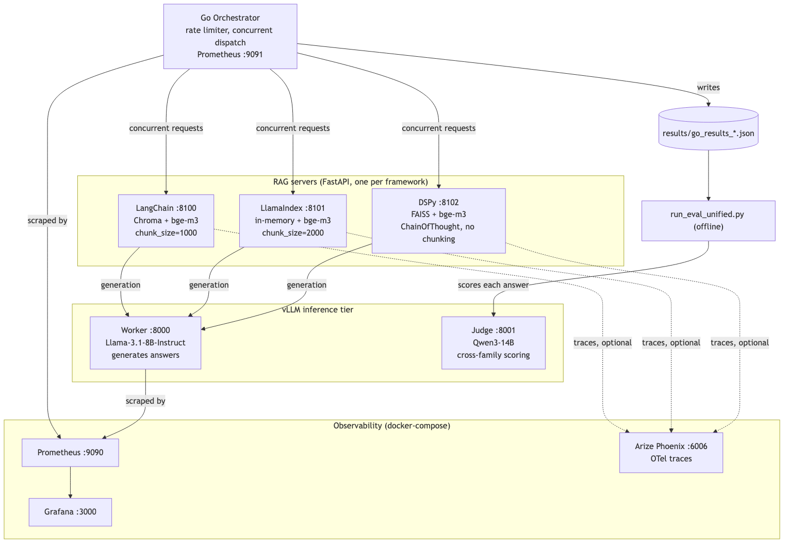
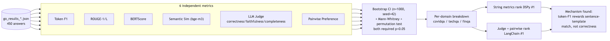
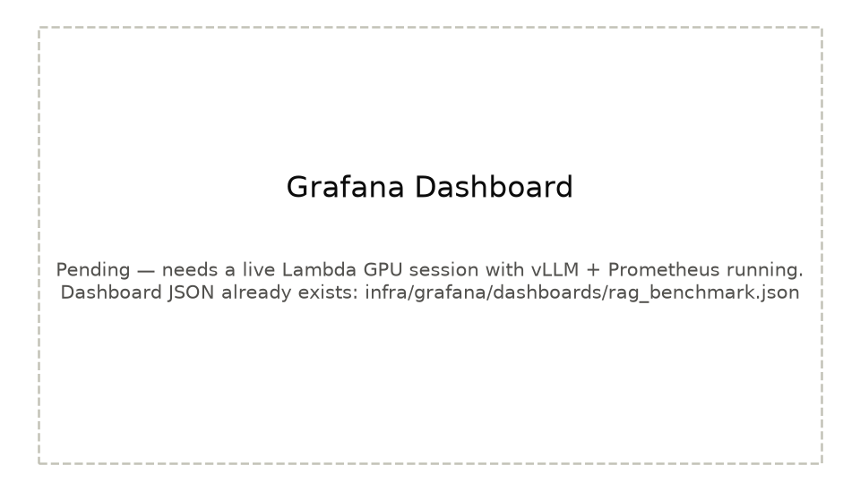
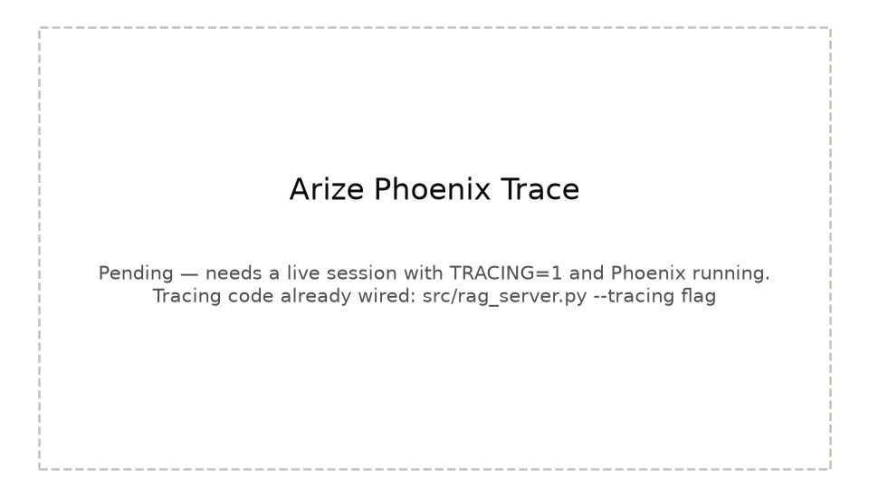

# RAG Framework Benchmark: LangChain vs LlamaIndex vs DSPy

## TL;DR

Benchmarking three production RAG frameworks — LangChain, LlamaIndex, DSPy — on the same LLM, same embedding model, and the same 450 real questions across three domains (covidqa, techqa, finqa). Scored six independent ways: word-overlap metrics, semantic similarity, an LLM judge, and pairwise preference.

**Does framework choice matter?** Yes — but which framework "wins" depends entirely on which metric you trust. Every word-overlap metric ranks DSPy first. The LLM judge and pairwise preference both rank LangChain first. Full details in [`docs/DETAILS.md`](docs/DETAILS.md).

---

## Architecture



Go orchestrator dispatches rate-limited, concurrent requests to three FastAPI RAG servers (LangChain/Chroma, LlamaIndex/in-memory, DSPy/FAISS), all generating through one shared vLLM-served Llama-3.1-8B. Scoring happens offline, afterward, by a cross-family judge (Qwen3-14B) reading the stored results — never in the live request path.



Full pipeline breakdown, chunk-size differences between frameworks, and the reasoning behind each infra choice: [`docs/DETAILS.md §1-2`](docs/DETAILS.md#1-experimental-design).

---

## Key Results

### Quality (450 queries, 150 per framework)

| Metric | LangChain | LlamaIndex | DSPy | Winner |
|--------|-----------|------------|------|--------|
| Token F1 | 0.461 | 0.462 | **0.488** | DSPy |
| BERTScore F1 | 0.831 | 0.834 | **0.844** | DSPy |
| Correctness (Qwen judge) | **0.592** | 0.559 | 0.488 | LangChain |
| Faithfulness (Qwen judge) | **0.825** | 0.712 | 0.648 | LangChain (p<0.001) |
| Completeness (Qwen judge) | **0.550** | 0.505 | 0.422 | LangChain |

Only LangChain's faithfulness advantage clears both required significance tests (p<0.001) — everything else is marginal or domain-dependent. Full table with confidence intervals, ROUGE, semantic similarity, context coverage, and judge ECE: [`docs/DETAILS.md §3`](docs/DETAILS.md#3-statistical-analysis).

### Latency (median, concurrent load — see caveat in docs)

| Framework | Retrieval | Generation |
|-----------|-----------|------------|
| LangChain | 117ms | 1,635ms |
| LlamaIndex | 387ms | **1,130ms** |
| DSPy | 119ms | 3,580ms |


Full percentiles and the concurrency caveat: [`docs/DETAILS.md §4`](docs/DETAILS.md#4-latency-analysis).

### Pairwise preference — LangChain wins every head-to-head


Total wins: LangChain 172, LlamaIndex 133, DSPy 103 (~63% LangChain win rate, 143 questions, Qwen3-14B judge). Per-matchup scores and per-domain breakdown (DSPy wins finqa by 14 points, collapses on techqa): [`docs/DETAILS.md §3`](docs/DETAILS.md#3-statistical-analysis).

### Observability




Both pending a live Lambda GPU session — dashboard JSON and tracing code already exist, just not yet exercised end to end. Details: [`docs/DETAILS.md §7`](docs/DETAILS.md#7-design-decisions).

---

## Why This Matters

Picking a RAG framework is usually a vibes decision — whichever has the best docs or the loudest advocate on the team. This project isolates one variable at a time: same LLM, same embeddings, same 450 questions, only the framework changes. The finding that matters most isn't "DSPy vs LangChain" — it's that the answer depends more on *how you define quality* than on the framework itself, and that's a mistake worth avoiding before it costs a real production decision. See [`docs/DETAILS.md §6`](docs/DETAILS.md#6-error-analysis) for the exact mechanism behind that finding, with real examples.

---

## Quick Start

### On Lambda Cloud (2x H100 recommended)

```bash
git clone https://github.com/sharle21/RAG-Framework-Comparison-LangChain-vs-LlamaIndex-vs-DSPy.git rag-bench
cd rag-bench && bash setup_lambda.sh <hf-token>
source ~/vllm_env/bin/activate

# Start worker (GPU 0) and judge (GPU 1) — see docs/DETAILS.md §7 for full commands
CUDA_VISIBLE_DEVICES=0 nohup python -m vllm.entrypoints.openai.api_server --model meta-llama/Llama-3.1-8B-Instruct --port 8000 --gpu-memory-utilization 0.90 --max-model-len 8192 > /tmp/vllm_worker.log 2>&1 &
CUDA_VISIBLE_DEVICES=1 nohup python -m vllm.entrypoints.openai.api_server --model Qwen/Qwen3-14B --port 8001 --gpu-memory-utilization 0.90 --max-model-len 8192 > /tmp/vllm_judge.log 2>&1 &

export PATH="/usr/local/go/bin:$PATH"
RPS=5 WORKERS=8 bash orchestrator/run_servers.sh   # runs the benchmark
python run_eval_unified.py                          # scores it
```

### Local evaluation (no GPU needed)

```bash
pip install bert-score rouge-score scipy
python reproduce.py
```

Reproduces every locally-computable number in this README from the committed `results/*.json` — no vLLM, no GPU, no LLM API calls. Full explanation: [`docs/DETAILS.md §7`](docs/DETAILS.md#7-design-decisions).

---

## Repository Structure

```
├── src/
│   ├── langchain_rag/pipeline.py      # Chroma + bge-m3, LCEL chain
│   ├── llamaindex_rag/pipeline.py     # In-memory VectorStoreIndex + bge-m3
│   ├── dspy_rag/pipeline.py           # FAISS + ChainOfThought, LiteLLM cache fix
│   ├── rag_server.py                  # Unified FastAPI server (--framework flag)
│   └── evaluation/
│       ├── metrics.py                 # Token F1, BERTScore, LLM judge, ECE
│       ├── adversarial_agent.py       # Adversarial query gen + robustness eval
│       └── tracing.py                 # Arize Phoenix / OTel instrumentation
├── orchestrator/
│   ├── main.go                        # Go orchestrator, rate limiter, Prometheus
│   ├── run_servers.sh                 # Start all servers + run benchmark
│   └── generate_queries.py            # Deterministic query sampling (per domain)
├── docs/DETAILS.md                    # Full methodology, results, error analysis, bug diary
├── images/                            # Architecture, latency, pairwise, dashboard visuals
├── docker-compose.yml                 # Prometheus + Grafana + Arize Phoenix
├── run_eval_unified.py                # Single-pass eval: judge once, aggregate globally + by domain
├── reproduce.py                       # Single-command local reproduction (no GPU)
├── run_retrieval_overlap.py           # Reference-document overlap rate (local, no GPU)
└── setup_lambda.sh                    # Lambda Cloud GPU instance setup
```

---

## Key Findings

1. **String metrics and LLM judge point in opposite directions.** Every word-overlap metric ranks DSPy #1; the judge and pairwise preference both rank LangChain #1. Concrete mechanism (a wrong number can outscore a right one on token-F1): [`docs/DETAILS.md §6`](docs/DETAILS.md#6-error-analysis).
2. **LangChain faithfulness is the only statistically solid claim** — p<0.001 against both other frameworks. Everything else in the quality table is marginal or domain-dependent.
3. **DSPy dominates financial reasoning** (finqa correctness 0.840, highest single-domain score in the benchmark) but collapses on techqa (0.630) — aggregate rankings hide this reversal.
4. **LangChain wins every pairwise head-to-head** (~63% win rate, 143 questions) — corroborates the absolute judge scores across a second evaluation protocol.
5. **MIPROv2 prompt optimization made DSPy worse**, not better — it optimized token-F1, a metric this project shows can reward incorrect answers.
6. **DSPy hallucinates more under out-of-distribution pressure** (0.200 refusal rate vs LangChain's 0.867) — ChainOfThought fabricates plausible reasoning when the corpus has no answer.
7. **The benchmark's own ground truth has at least one labeling error** — found because all three independently-built frameworks agreed with the source document, not the label.

---

## More Detail

- [`docs/DETAILS.md`](docs/DETAILS.md) — full methodology, statistical analysis, latency breakdown, adversarial evaluation, error analysis (18 real cases), design decisions, and bug diary

---

## References

- [RAGBench Dataset](https://huggingface.co/datasets/rungalileo/ragbench)
- [DSPy](https://github.com/stanfordnlp/dspy) — Stanford NLP
- [vLLM](https://github.com/vllm-project/vllm) — PagedAttention inference
- [MIPROv2](https://arxiv.org/abs/2406.11695) — Automatic prompt optimization
- [Arize Phoenix](https://github.com/Arize-ai/phoenix) — LLM observability

