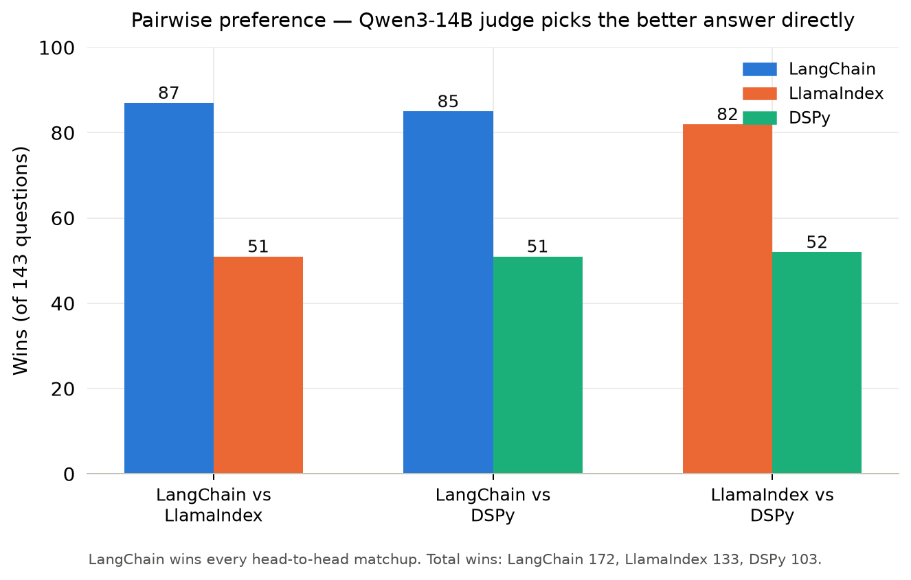
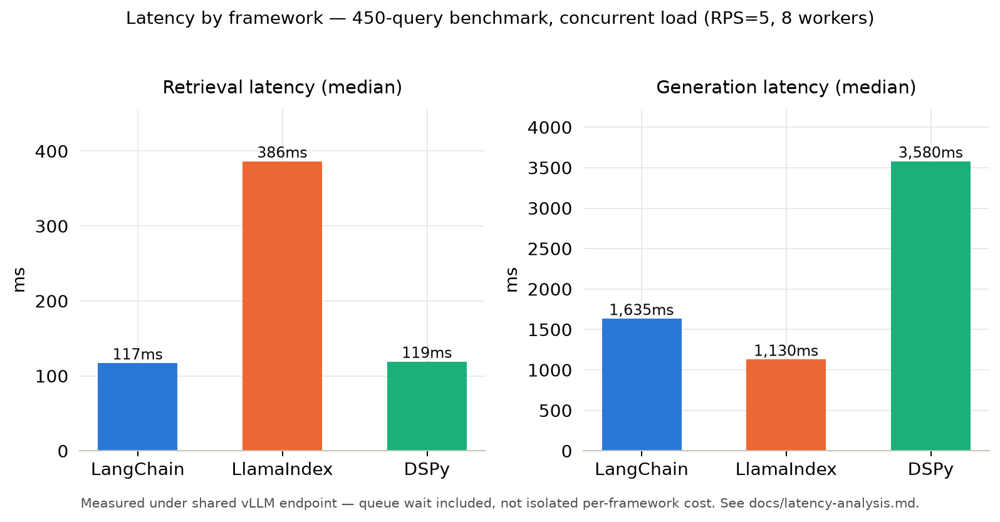

# Details — RAG Framework Comparison

Everything the top-level README summarizes, in full. One file, not a folder of files, on purpose — this is meant to be read start to finish or jumped into by section, not hunted across a dozen small pages.

## Contents

1. [Experimental Design](#1-experimental-design)
2. [Benchmark Methodology](#2-benchmark-methodology)
3. [Statistical Analysis](#3-statistical-analysis)
4. [Latency Analysis](#4-latency-analysis)
5. [Adversarial Evaluation](#5-adversarial-evaluation)
6. [Error Analysis](#6-error-analysis)
7. [Design Decisions](#7-design-decisions)
8. [Bug Diary](#8-bug-diary)

---

## 1. Experimental Design

### What's controlled vs. what varies

**Controlled:** same LLM (Llama-3.1-8B-Instruct via vLLM), same embedding model (bge-m3, 1024-dim), same 450-question test set, same judge (Qwen3-14B), same hardware.

**Varies:** each framework's retrieval implementation, vector store, and prompting strategy — built idiomatically per framework, not execution-graph-controlled.

### Framework comparison

| | LangChain | LlamaIndex | DSPy |
|-|-----------|------------|------|
| **Vector store** | Chroma (persistent SQLite) | In-memory VectorStoreIndex | FAISS |
| **Retrieval** | Similarity search, top-k | Similarity search, top-k | Similarity search, top-k |
| **Reasoning** | Standard RAG — retrieve then generate | Standard RAG — retrieve then generate | ChainOfThought — explicit reasoning chain before answer |
| **Prompt control** | LCEL chain, manual prompt | Query engine, internal prompt | DSPy signature + optimizer |
| **Index persistence** | Disk (survives restart) | In-memory (rebuilds on restart) | FAISS file + corpus JSON |
| **Token output** | Concise | Concise | Verbose (CoT adds reasoning tokens) |

**What ChainOfThought changes:** DSPy generates a reasoning chain before the final answer. This produces longer outputs, higher token F1 (more overlap chance), but also more hallucination risk on OOD questions where the chain fabricates steps.

### The chunk-size confound

"Same corpus" doesn't mean "same retrieval unit." Each pipeline was built idiomatically, so retrieval granularity differs by design, not by accident:

- **LangChain**: `RecursiveCharacterTextSplitter(chunk_size=1000, chunk_overlap=200)` (`src/langchain_rag/pipeline.py`)
- **LlamaIndex**: `SentenceSplitter(chunk_size=2000, chunk_overlap=200)` (`src/llamaindex_rag/pipeline.py`)
- **DSPy**: no splitter at all — indexes each raw RAGBench passage whole (median 3081 chars, up to ~51k chars) (`src/dspy_rag/pipeline.py`)

These are the values each pipeline was set up with from the start — not a bug, but a real, deliberate-looking difference nobody had explicitly decided on. It's also what caused a false "LangChain retrieval defect" finding during analysis — see [§6 Error Analysis](#6-error-analysis) and [§8 Bug Diary](#8-bug-diary).

### Why Go for orchestration

Python's GIL prevents true concurrency. Goroutines dispatch queries to all three RAG servers simultaneously, keeping the GPU saturated. At RPS=5 with 3 servers, 15 requests are in-flight at peak. The orchestrator uses a real token-bucket rate limiter (`rate.NewLimiter`, `golang.org/x/time/rate`), not a naive worker pool, and exposes Prometheus metrics natively via `prometheus/client_golang`.

The judge is decoupled from this live path entirely — it runs offline, afterward, against the stored results JSON (`run_eval_unified.py`), so judge latency never contaminates generation-latency measurements.

---

## 2. Benchmark Methodology

### Why six metrics?

No single metric captures answer quality. Running all six on the same outputs makes disagreements visible and measurable.

| Method | What it measures | Known limitation | DSPy rank | LangChain rank |
|--------|-----------------|-----------------|-----------|----------------|
| Token F1 | Exact word overlap with ground truth | Rewards verbosity | **1** | 2 |
| ROUGE-1/L | N-gram overlap | Rewards verbosity | **1** | 2 |
| BERTScore (distilbert) | Contextual semantic similarity | Rewards verbosity | **1** | 3 |
| Semantic sim (bge-m3) | Embedding similarity (same model as retrieval) | Rewards verbosity | 2 | **1** |
| Qwen3-14B judge correctness | Factual accuracy vs ground truth | LLM position/length bias | 3 | **1** |
| Qwen3-14B judge faithfulness | Grounded in retrieved context | LLM position/length bias | 3 | **1** |

The string metrics rank DSPy first because ChainOfThought generates longer answers with higher token overlap chance. The judge penalizes the same verbosity when answers drift from the retrieved context. Running both makes this tradeoff explicit — see [§6 Error Analysis](#6-error-analysis) for the concrete mechanism.

### Question sampling

450 benchmark queries = 150 questions (50 per domain × 3 domains) × 3 frameworks. Sampling is **deterministic, not random** — no seed involved because there isn't any randomness to seed: `orchestrator/generate_queries.py` takes the first 50 QA pairs per domain from `data/qa_pairs.json`, in file order (`by_domain[domain][:50]`). No shuffling.

That file order comes from `src/evaluation/prepare_data.py`, which concatenates each RAGBench HuggingFace subset's `test` split followed by `train` split, in the order `load_dataset` returns rows. Each domain's `test` split alone has more than 50 usable rows (techqa 314, finqa 2,294, covidqa 246), so **the benchmarked 150 questions are drawn entirely from each domain's held-out test split** — the `train` split is never touched by the actual benchmark, only by the (separate, optional) MIPROv2 training slice described below. This wasn't a deliberate stratified-sampling design — it's a byproduct of always taking the first N rows — but it does mean the benchmark isn't testing on train-split content.

**Reproducibility check:** regenerating `data/qa_pairs.json` from scratch (done mid-project, fixing an unrelated dedup bug — see [§8 Bug Diary](#8-bug-diary)) reproduced the exact same 150-per-domain question set as the original benchmark, verified by set-intersection against `results/go_results_20260408_013644.json`. Re-running `generate_queries.py` today would sample identically as long as `prepare_data.py`'s HuggingFace row order stays stable upstream.

### Cross-family judging

Qwen3-14B (Alibaba) judges Llama-3.1-8B (Meta) outputs. Different training lineage, different RLHF, different company — reduces same-model self-preference bias, though it doesn't rule out other judge biases (rubric bias, verbosity bias, position bias). Both run locally on vLLM; evaluation cost is near zero after instance startup.

### Adversarial evaluation

Four hard query types probing failure modes beyond standard accuracy:
- **Multi-hop** — requires connecting information across multiple documents
- **Ambiguous** — underspecified, missing key context
- **Out-of-distribution** — plausibly related but not in corpus; correct answer is refusal
- **Contradictory** — frames question as if the ground truth is false

Full results and discussion in [§5 Adversarial Evaluation](#5-adversarial-evaluation).

---

## 3. Statistical Analysis

### Approach

- **Bootstrap CIs across questions** (n=1000, seed=42): captures question-sampling variance — "would results change with a different set of benchmark questions?"
- **Mann-Whitney U + permutation test** (n=10,000): both must reach p<0.05 to claim significance. Controls false discovery from multiple comparisons.
- **Pairwise preference**: direct A-vs-B comparison avoids scale anchoring; more robust than absolute numeric scores.

### Quality (full table with confidence intervals)

| Metric | LangChain | LlamaIndex | DSPy | Winner |
|--------|-----------|------------|------|--------|
| Token F1 | 0.461 | 0.462 | **0.488** | DSPy |
| ROUGE-1 | 0.425 [0.395, 0.460] | 0.414 [0.384, 0.446] | **0.453** [0.422, 0.484] | DSPy |
| ROUGE-L | 0.343 [0.315, 0.376] | 0.328 [0.302, 0.357] | **0.384** [0.353, 0.416] | DSPy |
| BERTScore F1 | 0.831 | 0.834 | **0.844** | DSPy |
| Semantic Sim (bge-m3) | **0.830** | 0.816 | 0.823 | LangChain |
| Context Coverage | 0.646 | 0.721 | **0.734** | DSPy |
| Correctness (Qwen judge) | **0.592** [0.532, 0.650] | 0.559 [0.499, 0.620] | 0.488 [0.416, 0.560] | LangChain |
| Faithfulness (Qwen judge) | **0.825** [0.778, 0.870] | 0.712 [0.652, 0.767] | 0.648 [0.578, 0.715] | LangChain (p<0.001) |
| Completeness (Qwen judge) | **0.550** [0.485, 0.611] | 0.505 [0.447, 0.565] | 0.422 [0.362, 0.485] | LangChain |
| Judge ECE (↓ better) | **0.318** | 0.332 | 0.413 | LangChain |

CIs are 95% bootstrap (seed=42, n=1000). Significance: Mann-Whitney U + permutation test, both p<0.05.

- **Context Coverage** = fraction of ground-truth tokens in retrieved passages. DSPy/LlamaIndex retrieve more relevant content yet LangChain wins all judge metrics — generation quality from context matters more than raw coverage.
- **Judge ECE** (Expected Calibration Error) = gap between Qwen's stated confidence and actual correctness. Lower = better calibrated.

**Only one claim clears both significance tests at high confidence: LangChain's faithfulness advantage** (p<0.001, gaps of 0.113 vs LlamaIndex and 0.177 vs DSPy). Everything else in this table is marginal (p<0.05, small effect) or not significant — stated explicitly rather than oversold.

### Pairwise Preference (143 questions, Qwen3-14B judge)

Judge picks the better answer directly without numeric scoring — avoids scale anchoring bias.

| Matchup | Winner | Score |
|---------|--------|-------|
| LangChain vs LlamaIndex | **LangChain** | 87 – 51 |
| LangChain vs DSPy | **LangChain** | 85 – 51 |
| LlamaIndex vs DSPy | **LlamaIndex** | 82 – 52 |

**Total wins:** LangChain 172, LlamaIndex 133, DSPy 103. LangChain wins every head-to-head (~63% win rate). Pairwise and absolute judge scores agree.



### Per-Domain Breakdown

| Domain | Metric | LangChain | LlamaIndex | DSPy |
|--------|--------|-----------|------------|------|
| **covidqa** | F1 | 0.397 | 0.413 | **0.454** |
| | correctness | **0.721** | 0.649 | 0.681 |
| | faithfulness | **0.920** | 0.835 | 0.887 |
| **techqa** | F1 | 0.482 | **0.485** | 0.456 |
| | correctness | **0.703** | 0.687 | 0.630 |
| | faithfulness | **0.832** | 0.733 | 0.659 |
| **finqa** | F1 | 0.504 | 0.490 | **0.553** |
| | correctness | 0.696 | 0.690 | **0.840** |
| | faithfulness | 0.843 | 0.833 | **0.839** |

DSPy finqa correctness (0.840) is the highest single-domain score in the benchmark — 14 points above LangChain. DSPy collapses on techqa (0.630) where factual lookup doesn't benefit from chain-of-thought. Aggregate rankings hide this reversal — see [§6 Error Analysis](#6-error-analysis) for why DSPy's finqa "wins" specifically deserve scrutiny, not blind trust.

### Reference-Document Overlap Rate (`run_retrieval_overlap.py`, local, no GPU)

Distinct from **Context Coverage** above (which checks retrieved text against the *ground-truth answer*). This checks retrieved text against the *labeled relevant source documents* from RAGBench (`qa_pairs.json`'s `relevant_doc_ids`) — a closer approximation of retrieval recall, without needing doc IDs persisted at benchmark time. Match = word-containment ratio ≥0.6 in either direction (retrieved chunk mostly inside the relevant doc, or vice versa — needed because chunk sizes differ across frameworks, see [§1](#1-experimental-design)).

| Framework | Overall | covidqa | finqa | techqa |
|-----------|---------|---------|-------|--------|
| LangChain | 0.827 | 0.880 | 0.760 | 0.840 |
| LlamaIndex | 0.820 | 0.860 | 0.720 | 0.880 |
| DSPy | 0.780 | 0.860 | 0.640 | 0.840 |

Not Recall@k/NDCG (no ranking signal, approximate text matching rather than exact ID lookup) — reported as a directional retrieval-quality proxy. All three frameworks land in a similar 0.78-0.83 band; no framework shows a clear retrieval-recall advantage at this resolution.

### DSPy MIPROv2 Prompt Optimization

| Metric | Baseline | Optimized | Delta |
|--------|----------|-----------|-------|
| Token F1 | 0.483 | 0.483 | +0.001 |
| Correctness | 0.551 | 0.512 | **-0.039** |
| Faithfulness | 0.693 | 0.628 | **-0.065** |
| Completeness | 0.475 | 0.434 | **-0.041** |

All judge metrics dropped after MIPROv2 optimization. The optimizer's search metric was token-F1 (fast, no LLM cost) — which [§6 Error Analysis](#6-error-analysis) shows can reward a wrong number over a right one — so optimizing for it while judge quality drops is mechanistically expected, not a mystery. Trained on the first 20 DSPy benchmark answers, tested on the remaining ~124-130 (no train/test overlap).

One caveat on precision: rerunning the same *unoptimized* pipeline back-to-back produced different answers on 73% of questions (vLLM isn't fully deterministic under continuous batching even at `temperature=0`), with ~0.02 aggregate F1 drift between two identical runs — so while all three judge metrics dropping together is consistent with a real regression, the exact size of the drop is uncertain against that noise floor.

---

## 4. Latency Analysis

**Caveat, read first:** generation times measured under concurrent load — all 3 frameworks share one vLLM endpoint. Queue wait is included. DSPy's higher latency is real (more tokens), but absolute numbers are inflated by concurrent GPU pressure. These are not isolated, no-queue, or serial per-framework latency numbers.



### Latency (150 queries per framework, concurrent, RPS=5, 8 workers)

| Framework | Retrieval median | Retrieval p95 | Generation median | Generation p95 |
|-----------|-----------------|---------------|-------------------|----------------|
| LangChain | 117ms | 197ms | 1,635ms | 12,096ms |
| LlamaIndex | 387ms | 567ms | **1,130ms** | 19,105ms |
| DSPy | 119ms | 192ms | 3,580ms | 60,262ms |

At median, LlamaIndex generation is fastest. LangChain and DSPy have near-identical retrieval speed (Chroma and FAISS, 117ms vs 119ms — effectively tied, not a real difference). LlamaIndex's slower retrieval reflects in-memory index rebuild on startup.

Completion-token counts were never captured during the benchmark run, so DSPy's higher generation latency can't be cleanly attributed to token count vs. generation rate vs. queueing — all three plausibly contribute. A serial, no-concurrent-load rerun (`run_serial_latency.py` exists, not yet run) would be needed to isolate true per-framework generation cost.

---

## 5. Adversarial Evaluation

### Adversarial Robustness (n=30 per framework, exploratory — not a population estimate)

| Framework | Non-OOD | OOD Refusal | Multi-hop | Contradictory |
|-----------|---------|-------------|-----------|---------------|
| LangChain | **0.730** | **0.867** | 0.717 | **0.773** |
| LlamaIndex | 0.709 | 0.600 | 0.700 | 0.727 |
| DSPy | 0.710 | 0.200 | 0.703 | 0.727 |

OOD refusal rate = fraction of out-of-distribution questions correctly refused rather than hallucinated. DSPy's chain fabricates reasoning steps when no context is available (0.200 vs LangChain 0.867).

This set is small (30 questions per framework) and synthetically generated from only 10 source questions — directional signal, not a statistically robust population estimate. See [§6 Error Analysis](#6-error-analysis) for real transcript examples of both hallucination and correct refusal, including one case showing the hallucination failure mode isn't unique to DSPy's ChainOfThought architecture.

---

## 6. Error Analysis

A manual review of 18 real cases (query/context/answer level, not aggregate stats) behind the headline findings above. Summary of what it found, referenced throughout this document:

- **Token-F1 rewards sentence-template match, not correctness** — the concrete mechanism behind "string metrics and judge disagree." Real cases include DSPy stating a wrong dollar figure that scored F1=0.92 purely from matching phrasing, and a *correct* figure scoring F1=0.12 for being wrapped in a fuller sentence than the terse ground truth.
- **At least one likely ground-truth label error** in the underlying benchmark dataset — a case where all three independently-built frameworks agreed with the retrieved source document, not the label.
- **Real generation failures** where retrieval succeeded but the model still answered wrong, incomplete, or with the wrong framing.
- **OOD hallucination vs. correct refusal**, judged by Qwen3-14B — including one case showing the hallucination failure mode isn't unique to DSPy's ChainOfThought architecture.
- **A retrieval-metric artifact caught and fixed during this review** — an early "LangChain retrieval defect" finding turned out to be a one-directional overlap metric unfairly penalizing smaller chunk sizes; fixing the metric (not the framework) resolved it. See [§1 Experimental Design](#1-experimental-design).

This is a spot-check, not a systematic random sample — it demonstrates concrete failure/success patterns behind the aggregate numbers, not a statistically representative error rate.

---

## 7. Design Decisions

### Reproducibility (`reproduce.py`)

```bash
pip install bert-score rouge-score scipy
python reproduce.py
```

Runs ROUGE, BERTScore, bootstrap CIs, cross-metric ranking, significance tests, and retrieval-overlap rate in one command from the committed `results/*.json` — no vLLM, no GPU, no LLM API calls. Reproduces every locally-computable number in this project; doesn't rerun the LLM judge pass or the original benchmark itself (those need the Lambda GPU setup — see README Quick Start). Individual scripts (`run_bertscore.py`, `run_rouge.py`, etc.) still run standalone if you only want one piece.

### Observability stack

```
Prometheus  :9090  — scrapes vLLM + Go orchestrator metrics
Grafana     :3000  — latency, throughput, KV cache dashboards
Arize Phoenix :6006 — LLM quality traces via OpenTelemetry
```

```bash
docker compose up -d phoenix prometheus grafana
TRACING=1 RPS=5 WORKERS=8 bash orchestrator/run_servers.sh
# Traces:  http://localhost:6006
# Metrics: http://localhost:3000
```

Phoenix tracing is wired into `src/rag_server.py` (`--tracing` flag, or `TRACING=1` env var read by `run_servers.sh`) but has not yet been exercised in a full benchmark run — `images/phoenix_trace.png` and `images/grafana_dashboard.png` are placeholders pending that session. Grafana dashboard JSON already exists at `infra/grafana/dashboards/rag_benchmark.json`.

### Ragas (dependency exists, not part of any reported result)

`ragas==0.4.3` is pinned in `requirements.txt`, and `evaluate_ragas()` exists in `src/evaluation/metrics.py`, wired into an earlier all-in-one runner (`src/evaluation/run_benchmark.py`). No ragas output file exists in `results/`, and no ragas number appears in any published table — that pipeline was superseded by the current Go-orchestrator → `run_eval_unified.py` flow. Wired but never actually run for the canonical benchmark.

### Full Lambda Cloud setup

```bash
git clone https://github.com/sharle21/RAG-Framework-Comparison-LangChain-vs-LlamaIndex-vs-DSPy.git rag-bench
cd rag-bench && bash setup_lambda.sh <hf-token>

source ~/vllm_env/bin/activate
export LD_LIBRARY_PATH=/home/ubuntu/vllm_env/lib/python3.10/site-packages/nvidia/cu13/lib:$LD_LIBRARY_PATH

# Start worker model on GPU 0, wait until ready, then start judge on GPU 1
CUDA_VISIBLE_DEVICES=0 nohup python -m vllm.entrypoints.openai.api_server \
  --model meta-llama/Llama-3.1-8B-Instruct --port 8000 \
  --gpu-memory-utilization 0.90 --max-model-len 8192 > /tmp/vllm_worker.log 2>&1 &
until curl -s http://localhost:8000/v1/models | grep -q "Llama"; do sleep 10; done

CUDA_VISIBLE_DEVICES=1 nohup python -m vllm.entrypoints.openai.api_server \
  --model Qwen/Qwen3-14B --port 8001 \
  --gpu-memory-utilization 0.90 --max-model-len 8192 > /tmp/vllm_judge.log 2>&1 &

# Run benchmark (starts RAG servers sequentially, then fires Go orchestrator)
export PATH="/usr/local/go/bin:$PATH"
RPS=5 WORKERS=8 bash orchestrator/run_servers.sh

# Evaluate
PYTHONUNBUFFERED=1 nohup python -u run_eval_unified.py > /tmp/eval.log 2>&1 &
PYTHONUNBUFFERED=1 nohup python -u run_pairwise_eval.py > /tmp/pairwise.log 2>&1 &
```

Actual benchmark run used **2 GPUs** (worker on GPU 0, judge on GPU 1). `setup_lambda.sh` also supports 4-GPU instances (`CUDA_VISIBLE_DEVICES` pinning per model) but that capability was never what the published numbers ran on.

---

## 8. Bug Diary

| Bug | Root Cause | Fix |
|-----|-----------|-----|
| DSPy showing 4ms generation | LiteLLM disk cache active despite `cache=False` in `dspy.configure()` | Pass `cache=False` to `dspy.LM()` directly |
| LangChain all queries failing | Chroma index built with OpenAI 1536-dim, queried with bge-m3 1024-dim | Delete stale index, rebuild; remove from git with `git rm --cached` |
| LlamaIndex `ValueError: Unknown model` | `OpenAI` class rejects custom `base_url` | Switch to `OpenAILike` |
| Qwen3 `<think>` blocks breaking JSON parse | Qwen3-14B outputs `<think>...</think>` before JSON | Strip with `re.sub(r"<think>.*?</think>", "", raw, flags=re.DOTALL)` |
| OOM on server startup | All three servers embedding corpus simultaneously | Sequential startup in `run_servers.sh` |
| vLLM CUDA error 802 on fresh instance | CUDA system not initialized at driver level | Verify: `python -c "import ctypes; c=ctypes.CDLL('libcuda.so.1'); print(c.cuInit(0))"` — if 802, terminate and get new instance |
| Double judge calls for domain eval | `run_eval.py` + `run_eval_domains.py` each called judge on same 450 responses | Replaced with `run_eval_unified.py`: judge once, compute domain stats from same per-question rows |
| `qa_pairs.json` relevant_doc_ids pointing at documents that don't exist | `prepare_data.py` deduped passages by content, but ~51% of techqa passages (and similarly finqa) are reused verbatim across different questions — dedup silently dropped documents that later questions' IDs still referenced. Broke 312/450 queries' retrieval-recall lookups | Removed the dedup entirely — every `(question_idx, passage_idx)` is saved even if content repeats; corpus grew from 5,704 to 56,072 passages, all IDs now resolve |
| `compute_stats_local.py` judge scores didn't match published README numbers | It read `results/eval_scores.json` — the stale pre-fix file from the double-judge-call bug above, not the current `eval_unified.json` | Repointed at `results/eval_unified.json`; local reproduction now within rounding of published table |
| Latency table showed DSPy retrieval median as 63ms | Stale number from an earlier draft/results file — actual recomputed value from `compute_stats_local.py` is 119ms (p95 192ms), nearly tied with LangChain's 117ms, not uniquely fastest | Corrected table; caught while generating `latency.png`, by cross-checking the chart source against the published table before plotting it |
